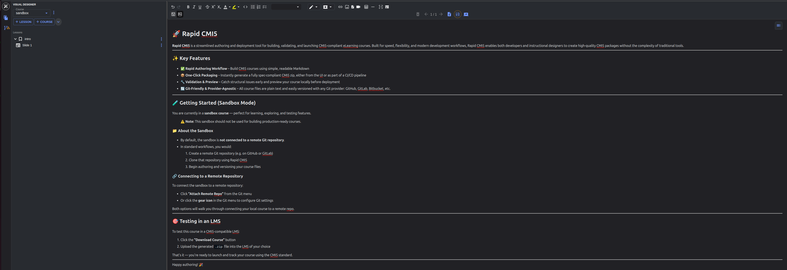

<p align="center">
    
</p>
<p align="center">
  
  
  
  
  
</p>

# Course Created · Course Codified

RapidCMI5 is an open source authoring tool built to accelerate the creation of modern courseware within the Total Learning Architecture (TLA). It provides a simple and intuitive interface for building CMI5 compliant content while automatically handling the xAPI, session, and packaging requirements defined by the standard. By combining a visual editor with a code centric workflow that supports change tracking and version control, RapidCMI5 enables teams to produce interoperable learning experiences that integrate cleanly with any TLA aligned LMS or LRS. As TLA adoption expands across DoD training programs, RapidCMI5 offers a fast and reliable path to standards compliant content from day one.

CMI5 is the modern specification for launching and tracking learning activities using xAPI. It defines how learning content communicates with an LMS, including enrollment, authentication, session management, and the standardized xAPI statements that represent a learner experience. Designed as the successor to SCORM, CMI5 removes the browser bound limitations of older standards and allows content to run anywhere while maintaining authoritative and interoperable learning records. Within the TLA, CMI5 acts as the core container format that ensures training content is portable, traceable, and compatible across systems.

## Backstory

We built RapidCMI5 as open source because learning tools should never come with vendor lock in or proprietary barriers. CMI5 and xAPI are open standards, and we believe the tools that support them should be open as well. By making RapidCMI5 free for everyone, forever, we ensure that organizations can build, modify, and deploy modern training content without relying on closed ecosystems or restrictive licensing. Open source empowers educators, developers, and government programs to collaborate, innovate, and maintain full control over their content.

RapidCMI5 began as a simple CMI5 player designed to render markdown content sourced from an MkDocs project. While MkDocs is an excellent tool for documentation and static sites, it does not provide the learner tracking, session management, or interoperability required by xAPI and CMI5. As the player evolved, it grew to support richer training scenarios, including automated cyber range deployments, embedded assessments, and extensive media support. This foundation eventually expanded into a full authoring ecosystem, which became RapidCMI5.

## Getting Started

RapidCMI5 provides prebuilt installers for Windows and Linux so you can start authoring CMI5 content immediately.

1. Download RapidCMI5

   You can find the latest release assets on the Releases page of this repository, including:

   - Windows Installer (.exe). Runs on Windows 10 and Windows 11 with no additional dependencies.
   - Linux AppImage (.AppImage). Works on most modern Linux distributions without requiring installation.

2. Install RapidCMI5

   - Windows: Run the downloaded .exe file and follow the installation prompts.
   - Linux: Make the .AppImage executable `chmod +x rapid-cmi5-x.y.z.AppImage` and run it `./rapid-cmi5-x.y.z.AppImage`.

3. Launch RapidCMI5
   After installation, you can launch RapidCMI5 from your Start Menu (Windows) or terminal (Linux).

4. Follow the in-app tutorial to create your first CMI5 course!

<p align="center">
    
</p>

## Feedback and Issues

If you encounter an issue or have a suggestion that could improve RapidCMI5, please open an issue on GitHub with details about the problem or the feature you would like to see. Whether it is a small usability improvement or a larger capability you feel would benefit the community, we want to hear from you. Your input helps guide development, strengthen the ecosystem, and ensure RapidCMI5 continues to serve everyone effectively.

## How to Assist With Development

RapidCMI5 is organized as an Nx monorepo that contains all components of the CMI5 authoring ecosystem. If you would like to contribute, improve features, or debug issues, this section explains how the repository is structured and how to build the desktop app locally.

### Monorepo Overview

This repository includes the following primary projects:

- Rapid CMI5 - The CMI5 authoring tool
- CMI5 Player - This is the web application that renders the cmi5 content authored within rapid cmi5
- CMI5 Builder - An option to allow for cmi5 content to be built in a container within a pipeline. Intended to help with DevOps work flows around content.

Each project is maintained within the same monorepo to ensure consistency, shared libraries, and streamlined development workflows.

<hr/>

### Serving the RapidCMI5 Application Locally

To serve the RapidCMI5 application locally, you can use the following command:

```bash
npx nx run rapid-cmi5-electron-frontend:serve
# Wait for frontend to finish starting
npx nx run rapid-cmi5-electron:serve
```

This will start a development server and make the application available locally.

<hr/>

### Building the RapidCMI5 Desktop Application

If you want to contribute code or test local changes, you can build the Electron-based desktop version of RapidCMI5.

1. Install Node and NPM

   We strongly recommend using NVM to manage Node versions:

   - NVM for Windows: https://github.com/coreybutler/nvm-windows
   - NVM for Linux: https://github.com/nvm-sh/nvm

   Install the latest LTS version of Node and NPM.

2. Install Dependencies

   - From the repository root, run: `npm ci`

3. Build the Electron Application

Run the following commands in order:

- `npx nx run rapid-cmi5-electron-frontend:build`
- `npx nx run cc-cmi5-player:build`
- `cp -r dist/apps/cc-cmi5-player apps/rapid-cmi5-electron/src/assets/cc-cmi5-player-dist`
- `npx nx run rapid-cmi5-electron:build`
- `npx nx run rapid-cmi5-electron:make`

After the build completes, the packaged installers will appear under: `./dist/executables/`.

## Automated tests

### Unit testing

`nx run-many --target=test --all `

This will run all unit tests in rapid cmi5

### E2E testing
`npx nx serve rapid-cmi5-electron-frontend`
`npx nx run rapid-cmi5-electron:e2e`

For interactive tests run
`npx nx run rapid-cmi5-electron:e2e --ui`


### Publishing to npm
to test a npm package you have built locally, first build with the nx.
then go to the output at ./dist/your-lib
run npm pack
then copy to the place you would wish to test the install with npm i <lib.version>.tgz
`